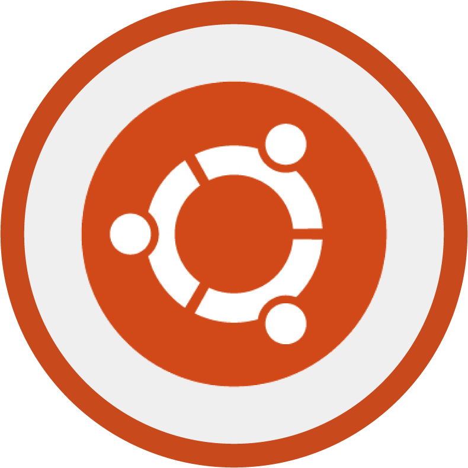
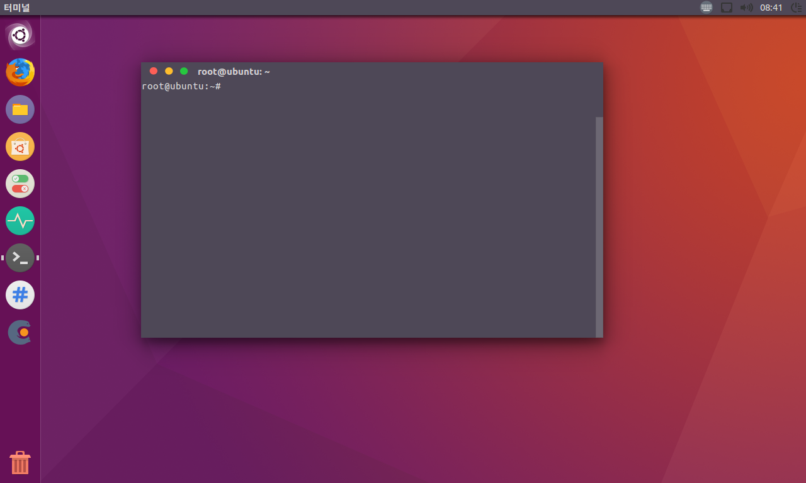
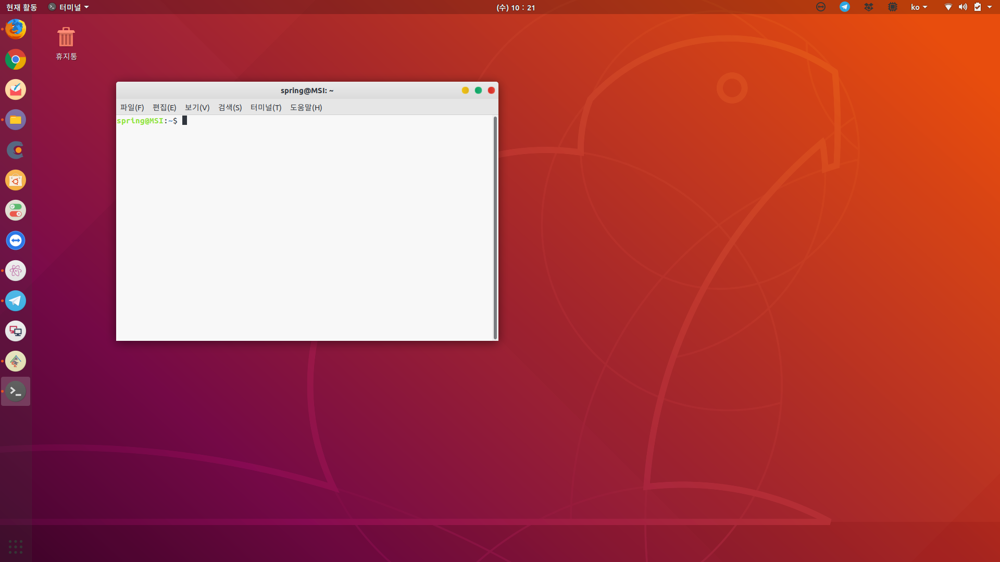
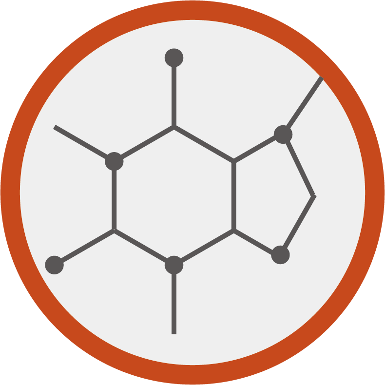
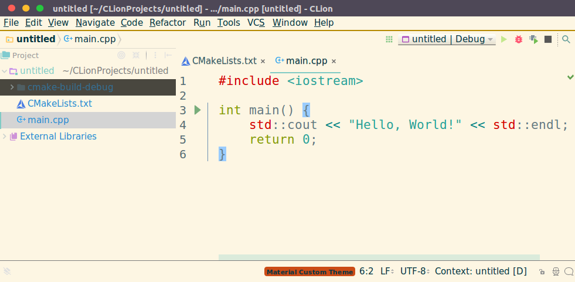
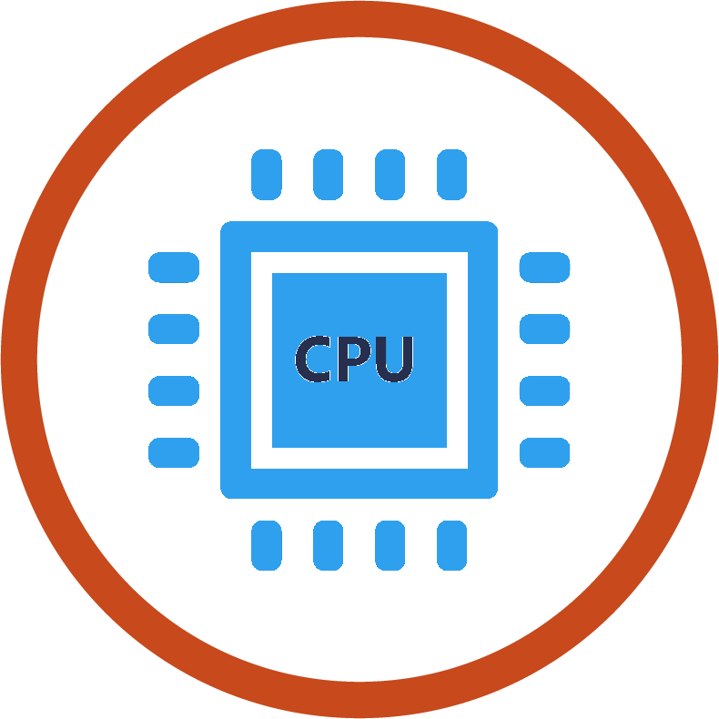
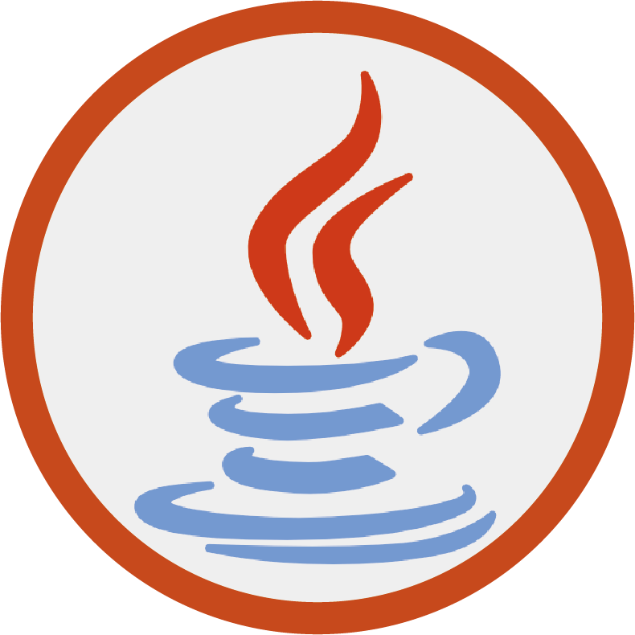
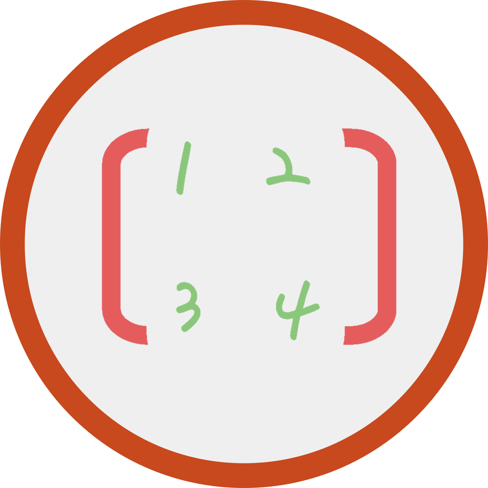

  USpring
---------------------------------------------------------------------------------------------------------------------------

### Ubuntu20.04, 18.04(x64) Setup Project

You have to install `install_basic.pl` before other scripts.

Ubuntu for Desktop
------------------

### Basic


This script will install **git** ,**gcc**, **g++** , **fpc** , **python3** , **vim** , **inkscape** , **cmake** , **gparted** , **exfat-utils** , **exfat-fuse** and **Royal-GTK-Theme for 16.04** ,**Snow-Theme for 18.04**, **Numix-Icon** . And installing some dependencies for other scripts.



### Apache2


The **[Apache](https://httpd.apache.org/)** HTTP Server Project is an effort to develop and maintain an open-source HTTP server for modern operating systems including UNIX and Windows. The goal of this project is to provide a secure, efficient and extensible server that provides HTTP services in sync with the current HTTP standards. BTW, This script is for Apache2-cgi(perl). I think I'm the only one who'll use it.

### Atom


**[Atom](https://atom.io/)** is a text editor that's modern, approachable, yet hackable to the core—a tool you can customize to do anything but also use productively without ever touching a config file.

### Bomi(16.04 only)


**[Bomi](https://bomi-player.github.io/)** is a multimedia player formerly known as CMPlayer, which is aimed for easy usage but also provides various powerful features and convenience functions. Just install and enjoy it! There will be already what you expect. If you don't like, you can configure almost everything.

### Caffe


**[Caffe](http://caffe.berkeleyvision.org/)** is a deep learning framework made with expression, speed, and modularity in mind. It is developed by Berkeley AI Research (**[BAIR](http://bair.berkeley.edu/)**) and by community contributors. **[Yangqing Jia](http://daggerfs.com/)** created the project during his PhD at UC Berkeley. Caffe is released under the **[BSD 2-Clause license](https://github.com/BVLC/caffe/blob/master/LICENSE)**.

### CLion


**[CLion](https://www.jetbrains.com/clion/)** is a smart C and C++ editor. It using CMake as a project model, CLion handles your changes in CMake files automatically, using all the information from there during code editing and refactorings.

It contains theme setting files too. 1. Go to `File -> Settings -> Plugins -> Browse Repositories` and search`Material Theme UI`.

After Install this theme, Go to `File -> Import Setting` and select `~/Program/clion-<version>/settings.jar`.



### Cpu-Performance


You can select performance mode(set to highest clock) and powersave mode(normal) on your system tray.

### CUDA


**[CUDA](https://developer.nvidia.com/cuda-downloads)** is a parallel computing platform and programming model developed by NVIDIA for general computing on graphical processing units (GPUs). With CUDA, developers are able to dramatically speed up computing applications by harnessing the power of GPUs.

### CUDNN


The NVIDIA CUDA® Deep Neural Network library (**[cuDNN](https://developer.nvidia.com/cudnn)**) is a GPU-accelerated library of primitives for deep neural networks. cuDNN provides highly tuned implementations for standard routines such as forward and backward convolution, pooling, normalization, and activation layers. cuDNN is part of the NVIDIA Deep Learning SDK.

### Firefox56


Mozilla **[Firefox](https://www.mozilla.org/ko/firefox/new/)** (or simply Firefox) is a free and open-source web browser developed by Mozilla Foundation and its subsidiary, Mozilla Corporation. Firefox-56 is the latest version before Quantum. Quantum not support multirow-tab and multirow-bookmark. so i still use firefox56.

### Hancom-Viewer


**[Hancom-viewer](http://www.hancom.com/cs_center/csDownload.do)** reads only for hwp files.

### Haroopad


**[Haroopad](http://pad.haroopress.com/user.html)** is a markdown enabled document processor for creating web-friendly documents.

### Imgur screenshot


This program can capture screen and upload to imgur server. You can easily write MarkDown note for insert image.

```
Capture window and upload : Ctrl+Shift+W
Capture region and upload : Ctrl+Shift+R
```

### Java

 for ubuntu 16.04

 for ubuntu 18.04

Java is a general-purpose computer-programming language that is concurrent, class-based, object-oriented and specifically designed to have as few implementation dependencies as possible.

### Kor2eng


It will make english name directory at home directory. Because, Some library or language(e.g. Python opencv) can't read korean path.

### Matlab


**[MATLAB](https://kr.mathworks.com/products/matlab.html)** (matrix laboratory) is a multi-paradigm numerical computing environment. A proprietary programming language developed by MathWorks, MATLAB allows matrix manipulations, plotting of functions and data, implementation of algorithms, creation of user interfaces, and interfacing with programs written in other languages, including C, C++, C#, Java, Fortran and Python.

### Neofetch


**[Neofetch](https://github.com/dylanaraps/neofetch)** is a CLI system information tool written in BASH. Neofetch displays information about your system next to an image, your OS logo, or any ASCII file of your choice. The main purpose of Neofetch is to be used in screenshots to show other users what OS/Distro you're running, what Theme/Icons you're using etc.

### NVIDIA_Driver


This is NVIDIA Graphic driver. It will restart automatically after installation.

### OpenBLAS


**[OpenBLAS](http://www.openblas.net/)** is an optimized BLAS library based on GotoBLAS2 1.13 BSD version. Usually we use BLAS for Matrix Multiplication in C. C++ has [Eigen](eigen.tuxfamily.org/) and Python has numpy.

Likewise library link command is in cblas.h. You just need to include. and if you are using gcc then link below command.

```bash
gcc <...> -lopenblas
```

```bash
gcc <...> `pkg-config --libs openblas`
```

There is a example code in [tests/openblas_test.c](tests/openblas_test.c).

### OpenCV


**[OpenCV](https://opencv.org/)** is open source computer vision library.

It will install `opencv2(latest)`, `opencv3(latest with contrib)` and `opencv3(latest as world)`. BCZ, opencv2 is for C. gcc can't compile opencv3.x So i made opencv installer for both compiler.

##### Compile as C(gcc)

```bash
gcc <...> `pkg-config --libs opencv2`
```

```bash
gcc <...> -lopencv_coreC -lopencv_highguiC ...
```

##### Compile as C＋＋(g＋＋)

```bash
g++ <...> `pkg-config --libs opencv3`
```

```bash
g++ <...> `pkg-config --libs opencv`
```

```bash
g++ <...> -lopencv_core -lopencv_highgui ...
```

```bash
g++ <...> -lopencv_world
```

It automatically select right header for compiler.

### Teamviewer


**[TeamViewer](www.teamviewer.com)** is a proprietary computer software package for remote control, desktop sharing, online meetings, web conferencing and file transfer between computers.

### Vmware-Player


VMware Workstation is a hosted hypervisor that runs on x64 versions of Windows and Linux operating systems

### Waterfox


**Use waterfox instead firefox56.**
Waterfox is an open-source web browser for 64-bit operating systems, with an aim to be speedy, ethical, and maintain support for legacy extensions dropped by Firefox, from which it is forked. There are official releases for 64-bit Windows, macOS, 64-bit Linux, and 64-bit Android.
